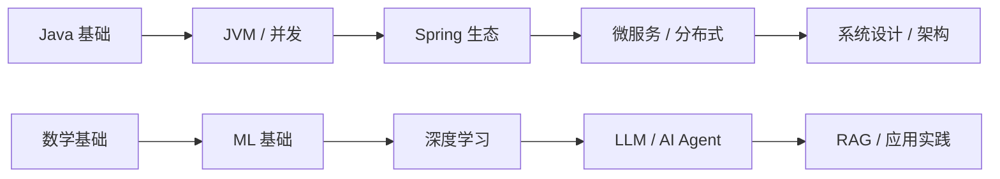

# 🗺️ 学习路线

> 体系化的学习路径规划，帮助梳理每个领域的学习阶段与关键节点。

---

## 📋 路线总览

---

## ☕ Java 后端学习路线

### 第一阶段：Java 核心基础
- Java 语法与面向对象
- 集合框架、泛型、异常
- IO / NIO
- 反射、注解
- Lambda / Stream

### 第二阶段：JVM 与并发
- JVM 内存模型与垃圾回收
- 类加载机制
- 并发编程（JUC）
- 锁优化与 AQS

### 第三阶段：Spring 生态
- Spring Boot 自动配置原理
- Spring MVC 流程
- MyBatis / JPA
- Spring Security

### 第四阶段：微服务与分布式
- Spring Cloud 全家桶
- 服务注册发现（Nacos / Eureka）
- 配置中心
- 网关（Gateway）
- 分布式事务

### 第五阶段：进阶与架构
- 系统设计
- 性能优化
- 高可用 / 高并发
- DDD 领域驱动设计

---

## 🤖 AI / LLM 学习路线

### 第一阶段：数学基础
- 线性代数（矩阵运算、特征值分解）
- 概率论与统计（贝叶斯、分布）
- 微积分（梯度、优化）

### 第二阶段：机器学习基础
- 监督学习（回归、分类、SVM、树模型）
- 无监督学习（聚类、降维）
- 模型评估与调优

### 第三阶段：深度学习
- 神经网络基础
- CNN / RNN / Transformer
- PyTorch / TensorFlow 实践

### 第四阶段：LLM 与大模型
- Transformer 架构详解
- 预训练与微调
- Prompt Engineering
- RAG 检索增强生成
- Agent 智能体

### 第五阶段：AI 工程化
- LangChain / Spring AI
- 模型评估与监控
- AI 应用架构设计

---

## 📊 机器学习学习路线

- **入门**：吴恩达《Machine Learning》课程
- **经典教材**：周志华《机器学习》（西瓜书）
- **实践**：李沐《动手学深度学习》
- **进阶**：PRML / ESL

---

> 💡 持续更新中... 每条路线将逐步添加详细的子页面和学习笔记。
